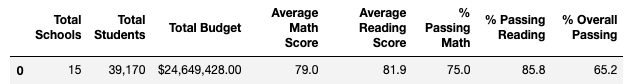
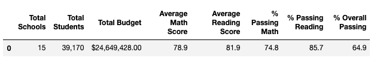
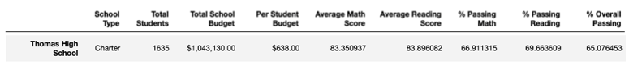
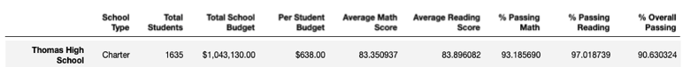
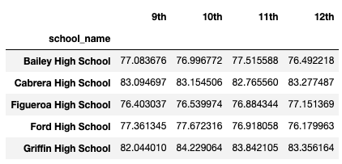
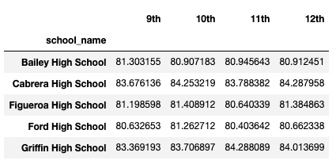
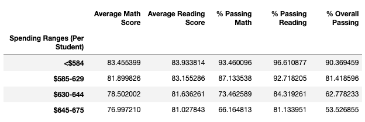
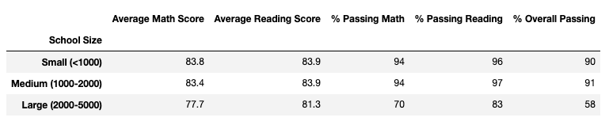
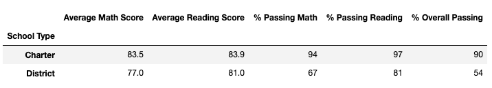

# School_District_Analysis_Challenge

## Overview
The purpose of this analysis is to find how reading and math grades for ninth graders affected the Schoold District analysis.

## Results

### School District Summary Before Correction:

### School District Summary After Correction:

We can observe that Overall Passing Percentage dropped from 65.2% to 64.9%.

### School Summary Before Correction:

### School Summary After Correction:

### Affect on Math Scores By Grade

### Affect on Reading Scores By Grade

### Scores By School Spending

### Scores By School Size

### Scores By School Type

## Summary
The major changes observed were in the Overall Passing Percentage.